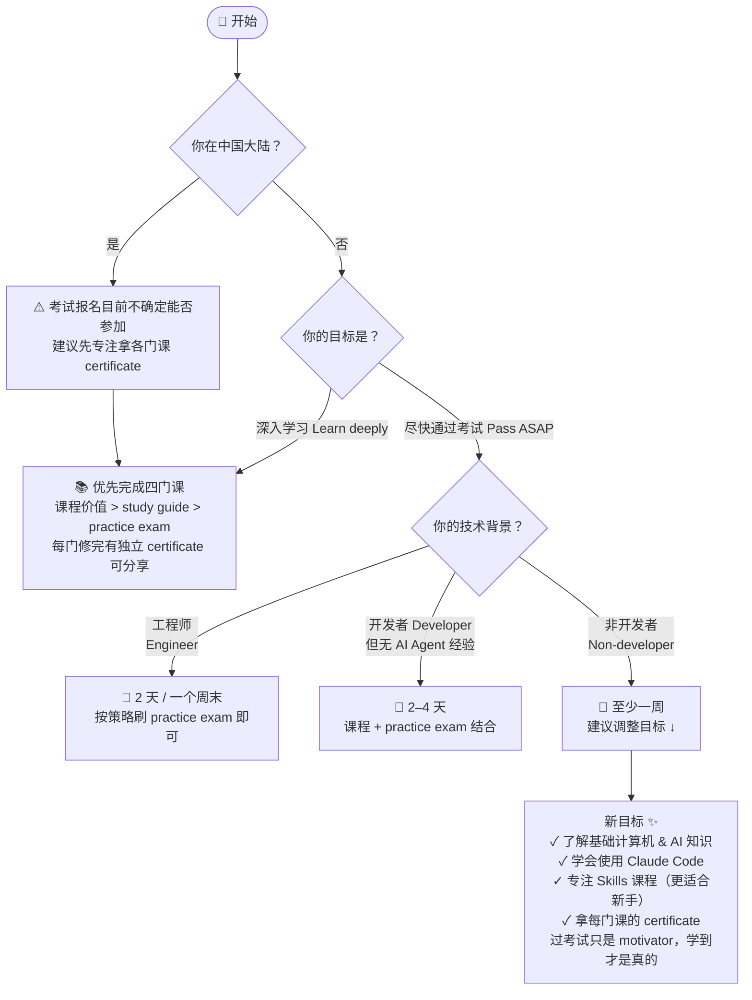
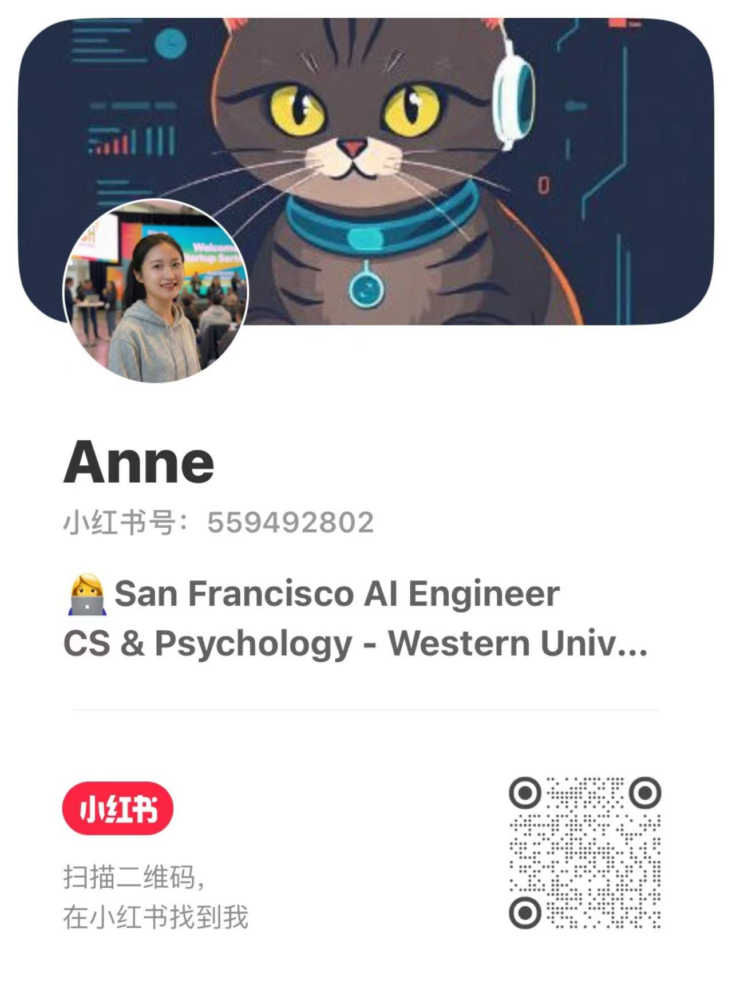

# Claude 认证备考指南 🤖

> 备考攻略 + 学习资料全整理，帮你找到最适合自己的学习路径 🎯
>
> 两个视频涨了 1000+ 赞、500+ 粉，大家问的最多的就是"怎么开始学"——这个 repo 就是答案。

---

## 🚀 怎么开始

花 30 秒回答三个问题，找到你的学习路径 👇

**各路径推荐学习顺序：**

| 路径 | 推荐顺序 |
|---|---|
| 🏃 工程师 | Practice Exam → Study Guide 补盲点 → 考试 |
| 📅 开发者（无 Agent 经验） | 课程（重点）→ Practice Exam → 考试 |
| 🌱 非开发者 | Skills 课程 → Claude Code in Action → 其他课程 → 拿 certificate |
| 📚 深入学习 / 国内用户 | 四门课全部完成 → 拿 certificate → 按需决定是否考试 |

---

## 📚 去哪里学

> 官网 Google 不好搜，搜出来全是培训机构广告，直接用下面链接！

**官网总入口：** https://anthropic.skilljar.com/

**四门课（每门修完有独立 certificate，可以在网上分享）**

| 课程 | 链接 | 适合人群 |
|---|---|---|
| Introduction to Agent Skills | https://anthropic.skilljar.com/introduction-to-agent-skills | ⭐ 所有人，尤其推荐非开发者 |
| Claude Code in Action | https://anthropic.skilljar.com/claude-code-in-action | ⭐ 所有人必看 |
| Claude with the Anthropic API | https://anthropic.skilljar.com/claude-with-the-anthropic-api | 开发者 |
| Introduction to Model Context Protocol | https://anthropic.skilljar.com/introduction-to-model-context-protocol | 开发者 |

> 课程风格：example-oriented，用几秒讲理论，然后完整的 end-to-end example 带你走一遍。
> 学完真的能直接用，不会因为 terminal 里改了一个配置就不知所措 💪

---

## 📝 考试须知

> 不打算考试？跳过这段，专注拿各门课 certificate 就够了 ✅

- **报名资格**：目前仅限 partner companies，暂不开放个人注册
- **国内报考**：能否参加不确定；小红书有抱团报名的帖子，注意避开收费培训机构
- **考试费用**：$49.99（优惠价）或 $99（原价），取决于公司和报名时间
- **出成绩时间**：七天内
- **证书有效期**：六个月
- **考不过怎么办**：六个月内不可重考，要认真准备再上！
- **考试方式**：不需要预约，在线直接考
- **Practice Exam**：报名后获得，60 道题，格式与正式考试非常接近，建议做 **2–3 遍**直到全都搞懂

---

## 💬 找我聊聊

有问题？学习路上遇到坑？欢迎来小红书找我 👇

  
    
  <strong>小红书 @Anne &nbsp;|&nbsp; 小红书号：559492802</strong>

